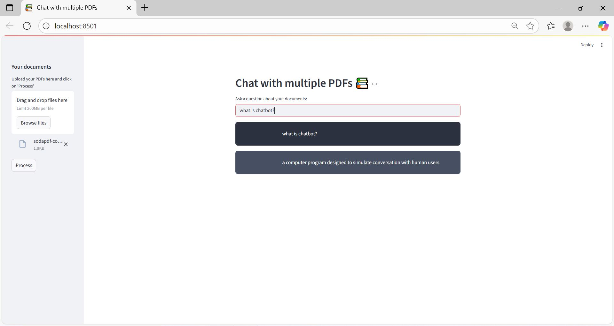

# 📚 Chat with Multiple PDFs  
> Interactively chat with your PDF documents using AI 🤖

---

## 🚀 Overview  

**Chat with Multiple PDFs** is a Streamlit-based web application that allows users to upload multiple PDF files and ask questions about their contents.  
It extracts text from PDFs, splits them into chunks, embeds the text using **Hugging Face sentence-transformers**, stores them in a **FAISS** vector database, and uses a **Google Flan-T5** model to generate intelligent, context-aware responses.  

This project demonstrates how **Large Language Models (LLMs)** can be integrated with **retrieval-based systems** for document understanding.

---

## 🧩 Features  

- 📄 Upload and process multiple PDF documents simultaneously  
- 💬 Ask natural language questions and get AI-generated answers  
- ⚙️ Uses **FAISS** for vector storage and retrieval  
- 🧠 Supports **contextual conversation** using memory  
- 🤖 Powered by **Flan-T5** and **LangChain** for reasoning and text generation  
- 🌐 Built with a simple and responsive **Streamlit** UI  

---

## 🛠️ Tech Stack  

| Component | Technology |
|------------|-------------|
| **Frontend/UI** | Streamlit |
| **Text Extraction** | PyPDF2 |
| **Text Embedding** | Sentence Transformers (MiniLM-L6-v2) |
| **Vector Store** | FAISS |
| **LLM Model** | Google FLAN-T5 |
| **Framework** | LangChain |
| **Environment Management** | Python dotenv |

---

## 🧠 How It Works  

1. **PDF Upload:** You can upload one or more PDFs.  
2. **Text Extraction:** The app reads and extracts text using **PyPDF2**.  
3. **Text Splitting:** Text is divided into chunks using **LangChain’s TextSplitter**.  
4. **Vectorization:** Each chunk is embedded using **Hugging Face sentence-transformers** and stored in a **FAISS** index.  
5. **Question Answering:** When you ask a question, relevant chunks are retrieved, and the **FLAN-T5** model generates an accurate, contextual response.  

---

## ⭐ Acknowledgements  

- [LangChain](https://github.com/hwchase17/langchain)  
- [Hugging Face Transformers](https://huggingface.co)  
- [Streamlit](https://streamlit.io)  
- [FAISS](https://github.com/facebookresearch/faiss)
